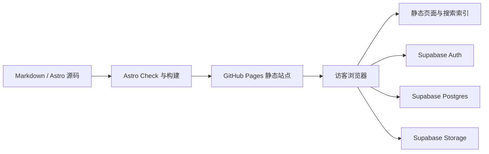

# 当前系统架构

## 架构结论

ASAW 采用“静态前端 + 托管后端服务”的混合架构。

- Astro 构建并输出静态页面。
- GitHub Pages 托管站点，不运行项目自有服务器。
- Supabase 提供身份认证、Postgres 数据库和对象存储。
- 仓库 Markdown 与 Supabase 文章共同构成内容来源。

## 构建与访问流程



## 运行时边界

```text
构建阶段
├── 校验 Content Collections
├── 生成内置文档路由
├── 生成静态搜索索引
└── 输出 dist

浏览器阶段
├── 页面、主题、复制交互与双来源搜索
├── 邮箱 OTP 登录与会话
├── 读取/修改个人资料
├── 读取公开文章
└── 管理员草稿、发布、审核和图片上传

托管服务阶段（Supabase）
├── Auth 身份认证
├── Postgres 数据与约束
├── RLS 行级权限
├── Security Definer 函数
└── Storage 对象权限
```

## 安全边界

- 前端只使用 Supabase URL 与 publishable key；它们是公开客户端配置。
- secret/service-role key、SMTP 密钥和用户验证码不得写入前端或仓库。
- 隐藏按钮不是权限控制；所有写操作必须由 RLS、约束或受控函数再次验证。
- 数据库变更记录在 `supabase/migrations/`，并需确认已应用到线上项目。
- 文章 HTML 只允许来自受控 Markdown 渲染流程，不直接信任用户输入的 HTML。

## 内容模型

```text
内置内容
└── src/content/docs/*.md
    ├── 构建时生成文章页面
    └── 正文进入构建时搜索索引

动态内容
└── Supabase articles
    ├── 草稿：仅管理员管理
    ├── 已发布：公开读取
    ├── 图片：article-images bucket
    ├── 贡献者：profiles
    └── 已发布正文在浏览器中并入搜索
```

## 主题架构

首次访问默认浅色。用户点击侧栏主题按钮在浅色和深色之间切换，选择保存在 `localStorage`，根元素通过 `data-theme` 驱动语义化 CSS 变量。

## 未来扩展原则

- 继续保持 Astro 静态托管，不因少量动态数据引入自建服务器。
- 需要可信服务端密钥、复杂任务或第三方回调时，再评估 Edge Functions 或独立后端。
- 独立竞赛平台保持业务与数据库边界，仅由门户提供链接。
- 评论和活动模块须先补 User Story、数据模型与权限设计。
