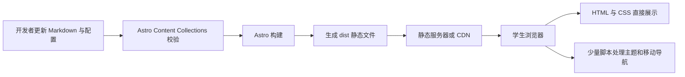

# MVP 系统架构

## 架构原则

- 静态优先：能在构建时完成的工作不放到浏览器或服务器运行。
- 内容与展示分离：开发者修改内容文件，组件只负责展示。
- 渐进增强：没有客户端 JavaScript时，核心内容仍然可阅读。
- 最小依赖：只为已确认的需求增加技术和包。

## 构建与访问流程



## 运行时边界

```text
构建阶段
├── 读取内容
├── 校验内容字段
├── 渲染 Astro 组件
└── 输出静态文件

浏览器阶段
├── 展示静态页面
├── 切换并保存主题
└── 控制移动端导航

不存在
├── 应用后端
├── 数据库
├── 登录会话
└── 内容发布 API
```

## 建议目录结构

```text
src/
├── components/
│   ├── Header.astro
│   ├── Hero.astro
│   ├── Updates.astro
│   ├── About.astro
│   ├── PlatformEntry.astro
│   ├── Footer.astro
│   └── ThemeToggle.astro
├── content/
│   └── updates/
├── layouts/
│   └── BaseLayout.astro
├── pages/
│   └── index.astro
├── styles/
│   ├── global.css
│   └── tokens.css
└── content.config.ts

public/
└── images/
    └── brand/
```

## 主题架构

```text
系统主题偏好
      ↓
有无本地手动选择？
  ├── 有 → 使用本地选择
  └── 无 → 使用系统选择
      ↓
在根元素设置 data-theme
      ↓
CSS 语义变量切换
      ↓
页面主体与导航栏使用同色系轻微分层
```

组件不能直接依赖“黑色”或“白色”这样的物理颜色，而应使用“页面背景”“主要文字”“导航背景”“导航文字”“边框”和“点缀”等语义变量。

## 未来扩展路径

- 增加详情页：从内容集合生成静态路由。
- 接入 CMS：替换内容加载来源，保留展示组件和字段模型。
- 增加内部发布：单独设计认证、权限、审计、数据库和 API，不塞入当前静态架构。
- 接入独立竞赛平台：继续使用明确的外部链接，不共享业务数据库。
