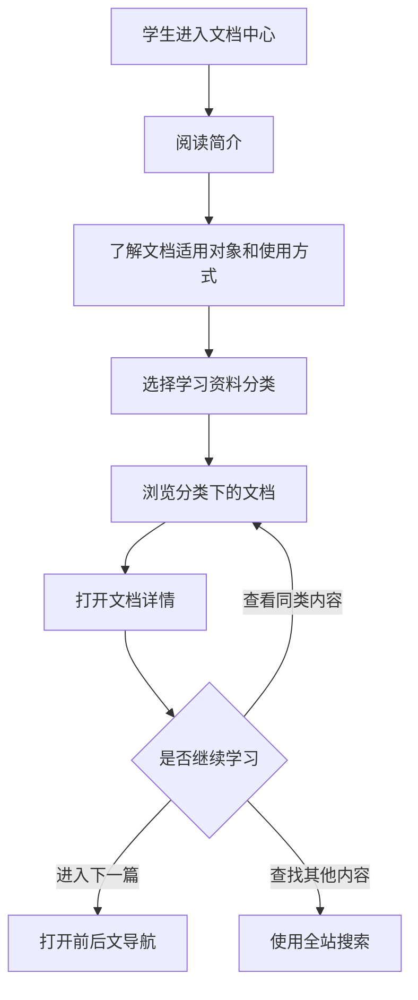

# 文档中心信息架构（初稿）

## 页面目标

为新生和低年级学生提供一个有说明、有分类、有学习顺序的资料入口，减少学生面对零散资料时不知道从哪里开始的问题。

## 首页结构

```text
文档中心
├── 简介
│   ├── 这里提供什么
│   ├── 适合哪些同学
│   └── 建议如何使用
└── 学习资料
    ├── 新生入门
    ├── 课程学习
    ├── 工具与技能
    ├── 科创入门
    └── 经验与常见问题
```

学习资料分类目前是候选结构，需要在 Sprint Planning 中继续确认。

## 用户浏览流程



## 页面层级

```text
/docs/                         文档中心首页
/docs/[category]/              分类页
/docs/[category]/[document]/   文档详情页
```

## 候选内容字段

```text
title          标题
description    简短说明
category       所属分类
audience       适用对象
updatedAt      更新时间
order          分类内顺序
draft          是否仍为草稿
```

## 技术方案

- 使用 Astro Content Collections 管理 Markdown 文档。
- 使用动态路由生成分类页和详情页。
- 构建时生成静态 HTML，不要求数据库或内容后台。
- 将已公开文档的标题、摘要和关键词加入现有静态搜索索引。

## 本轮边界

- 建立架构和少量示例文档，不追求一次性填满所有学习资料。
- 只收录可以公开给学生的内容。
- 外部资料需要标明来源和跳转目标，不直接复制受版权保护的内容。
- 正式内容和集中视觉调整可安排到后续整理 Sprint。
