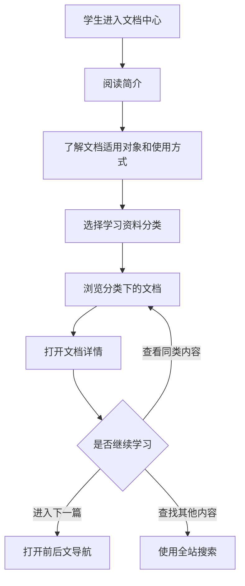

# 文档中心信息架构（初稿）

## 页面目标

为新生和低年级学生提供一个有说明、有分类、有学习顺序的资料入口，减少学生面对零散资料时不知道从哪里开始的问题。

## 参考站点分析

参考：[清华大学自动化系学生科协文档站](https://thuasta.org/docs/)。

值得借鉴的结构：

- 文档入口默认打开“简介”，先说明站点提供什么。
- 左侧使用可展开的多层目录，长期资料和专题资料可以同时存在。
- 分类首页使用摘要卡片展示子分类、说明和内容数量。
- 正文右侧显示“本页总览”，长文档可以快速跳到对应标题。
- 文末提供上一篇、下一篇和编辑入口，形成连续阅读与维护路径。

不直接照搬的部分：

- 不复制对方的分类名称、文案和视觉资产。
- 不切换到 Docusaurus，继续使用项目现有的 Astro 架构。
- Sprint 2 暂不开放公开投稿、Issue 或 Pull Request 教程，只建立内部维护指南。

## 首页结构

```text
文档中心
├── 简介
│   ├── 这里提供什么
│   ├── 适合哪些同学
│   └── 建议如何使用
└── 学习资料
    └── 基础工具
        └── VS Code
```

一级目录已确认只保留“简介”和“学习资料”。学习资料先建立“基础工具”二级目录，并从 VS Code 开始逐篇建设；不设立“新生起步”栏目。

## 桌面端阅读布局

```text
┌──────────────┬────────────────────────┬──────────────┐
│ 折叠树状目录 │ 标题、摘要与 Markdown 正文 │ 本页标题目录 │
│              │                        │              │
│ 多级标签展开 │ 分类页显示摘要卡片       │ 点击快速跳转 │
└──────────────┴────────────────────────┴──────────────┘
```

页面底部显示上一篇和下一篇。手机端真机布局仍按项目约定留到取得正式域名后验收。

## 用户浏览流程



## 页面层级

```text
/docs/            文档中心简介
/docs/[...id]/    任意层级的分类页或文档详情页
```

## 候选内容字段

```text
title          标题
description    简短说明
kind           category 或 document
audience       适用对象
order          同级内容顺序
updatedAt      更新时间
keywords       搜索关键词
draft          是否仍为草稿
sourceUrl      外部资料来源（可选）
```

## 技术方案

- 在 `src/content.config.ts` 中定义文档集合和字段校验规则。
- 使用 Astro Content Collections 的 `glob()` loader 管理多层 Markdown 文档。
- 使用 `/docs/[...id].astro` 和 `getStaticPaths()` 生成任意深度的静态页面。
- 从内容路径和 `order` 字段生成左侧目录、分类卡片和前后文导航。
- 使用 Markdown 渲染结果中的标题生成右侧本页目录。
- 构建时生成静态 HTML，不要求数据库或内容后台。
- 将已公开文档的标题、摘要和关键词加入现有静态搜索索引。

```text
src/
├── content.config.ts          文档字段和加载规则
├── content/docs/              Markdown 文档与分类说明
├── pages/docs/
│   ├── index.astro            文档简介
│   └── [...id].astro          分类与正文动态路由
└── components/docs/           侧边栏、目录、卡片和前后文导航
```

## 本轮边界

- 建立架构和少量示例文档，不追求一次性填满所有学习资料。
- 不为了模仿参考站点而增加培训资料、技术文章等当前没有明确需求的一级栏目。
- 只收录可以公开给学生的内容。
- 外部资料需要标明来源和跳转目标，不直接复制受版权保护的内容。
- 正式内容和集中视觉调整可安排到后续整理 Sprint。
