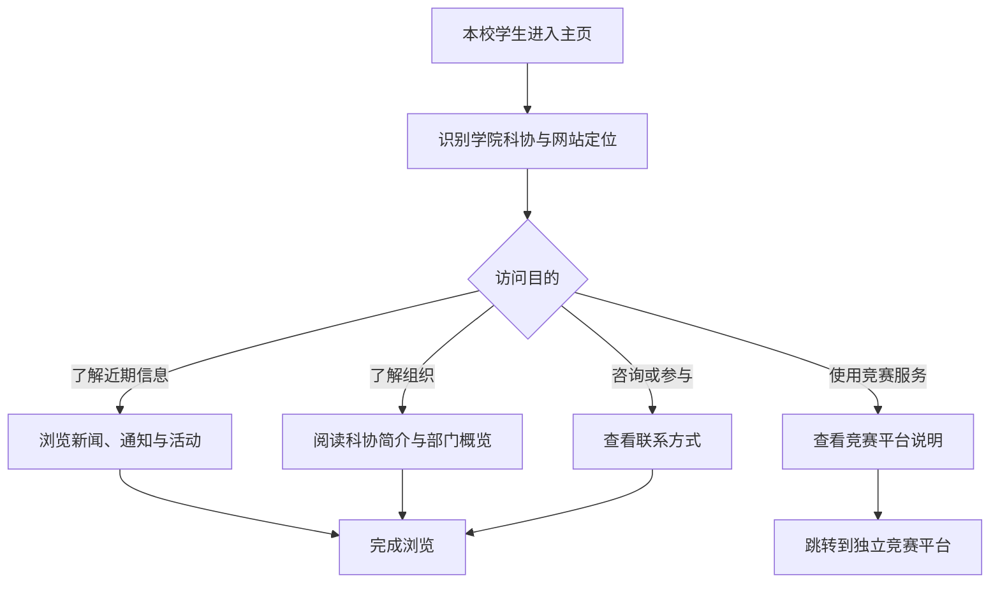
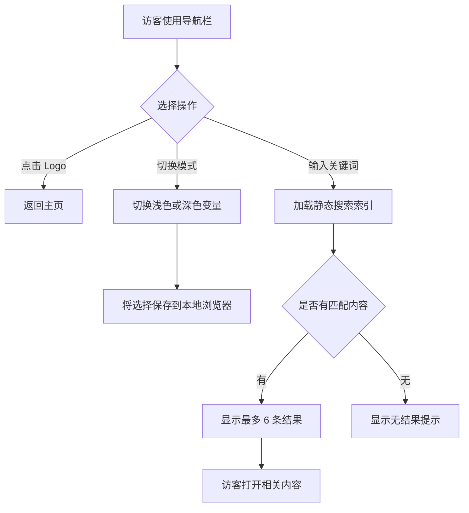

# 主页信息架构与验收标准

## 页面目标

让本校学生在一个公开主页内完成三件事：确认组织身份、获取近期信息、找到进一步了解或使用服务的入口。

## 信息架构

```text
导航栏
├── 主页 Logo 与组织名称入口
├── 文档入口
└── 右侧操作
    ├── 浅色 / 深色主题切换
    └── 全站搜索

品牌首屏
├── 中英文组织名称
├── 一句话定位
├── 主要行动入口
└── 品牌 Logo

近期动态
├── 通知
├── 活动
└── 新闻

关于科协
├── 科协简介
└── 部门概览

竞赛平台
└── 独立平台说明与外部链接

页脚
├── 联系方式
├── 地址或所属信息
└── 版权信息
```

## 用户浏览流程



## 响应式布局

### 桌面端

- 导航栏显示完整页内导航。
- 首屏采用文案与 Logo 双栏布局。
- 近期动态以三列展示。
- 科协简介与部门概览并列展示。

### 移动端

- 导航栏保留 Logo、菜单入口和主题切换。
- 首屏改为单列，Logo 与文案垂直排列。
- 动态卡片和部门信息全部改为单列。
- 所有主要操作无需横向滚动即可访问。

## User Story 与验收标准

### ASAW-001：主页框架

作为访客，我希望在一个主页中快速理解科协并找到重要内容。

- 页面包含品牌首屏、近期动态、科协介绍、竞赛平台入口和页脚。
- 导航链接可定位到对应主页区块。
- 手机与桌面宽度下不存在页面级横向滚动。

### ASAW-002：品牌首屏

作为访客，我希望一进入网站就识别组织身份。

- 首屏展示正式组织名称、Logo 和一句话定位。
- 首屏最多设置一个主要行动和一个次要行动。
- Logo 保持比例且不被裁切或拉伸。

### ASAW-003：近期动态

作为本校学生，我希望查看近期新闻、通知和活动。

- 每条动态至少包含类型、标题、日期和摘要。
- 内容按照日期从新到旧排列。
- 没有内容时显示明确的空状态，不留下破损卡片。

### ASAW-005：竞赛平台入口

作为本校学生，我希望前往独立竞赛平台。

- 入口明确标识为独立平台或外部服务。
- 未提供正式 URL 前不得伪造可用链接。
- 外部链接使用清晰可理解的链接文字。

### ASAW-007：开发者更新内容

作为开发者，我希望不修改布局组件就能更新主页内容。

- 新闻、通知、活动和部门信息存放在统一的结构化内容模块。
- 页面组件不包含散落的重复业务文案。
- 内容字段具有明确类型或校验规则。

### ASAW-010：主题切换

作为访客，我希望使用浅色或深色模式。

- 首次访问跟随操作系统主题偏好。
- 用户可以从导航栏手动切换主题。
- 手动选择保存在本地浏览器中。
- 浅色模式使用纯白主页和浅灰导航栏。
- 深色模式使用纯黑主页和近黑导航栏。
- 主题切换后全部文字、控件和焦点状态保持可辨认。
- 页面初次加载不出现明显的错误主题闪烁。

### ASAW-011：导航栏与全站搜索

作为访客，我希望随时返回主页并按关键词找到站内内容。

- 导航栏最左侧显示 Logo 和“人工智能学院学生科协”，点击任意位置均返回主页。
- 主页入口右侧显示文档链接，正式文档界面在后续 Sprint 实现。
- 导航栏最右侧显示搜索栏，主题切换位于搜索栏左侧。
- 搜索按标题、类别、摘要和关键词匹配站内内容。
- 无结果或索引加载失败时给出明确提示。
- 搜索框、结果链接和模式切换均可通过键盘操作。

## 导航与搜索流程



## 待提供素材

- 首屏一句话定位和简介文案
- 真实部门名称及职责摘要
- 首批新闻、通知和活动内容
- 竞赛平台正式名称与 URL
- 科协联系方式
- 学院官方标识及其使用规范（若需要展示）
